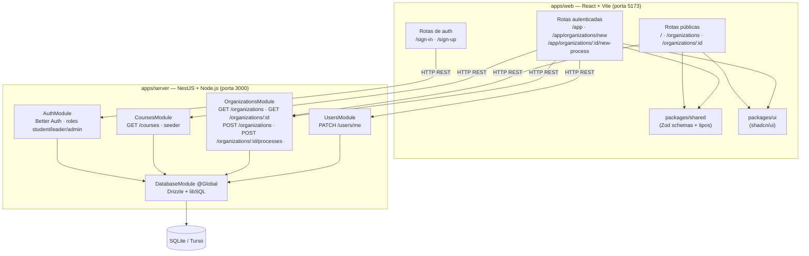

# ExtraUFLA

Plataforma web para centralizar informações sobre atividades extracurriculares da UFLA — empresas juniores, projetos de extensão e núcleos de estudo — com conteúdo personalizado pelo curso do aluno.

Trabalho Final da disciplina de **Engenharia de Software (GCC188)** — UFLA, 2026/1.

## Pré-requisitos

- [Bun](https://bun.sh) >= 1.3 (package manager)
- Node.js >= 22.6 (runtime)

## Instalação

```bash
bun install
```

## Configuração

Crie os arquivos `.env` em `apps/server/` e `apps/web/` com as variáveis necessárias.

**`apps/server/.env`**

```
DATABASE_URL=file:./local.db
BETTER_AUTH_SECRET=<gere-uma-chave-aleatória-de-32+-chars>
BETTER_AUTH_URL=http://localhost:3000
CORS_ORIGIN=http://localhost:5173
NODE_ENV=development
PORT=3000
```

**`apps/web/.env`**

```
VITE_SERVER_URL=http://localhost:3000
```

## Banco de dados

Para aplicar as migrações:

```bash
bun run db:migrate
```

## Cursos

Os cursos de graduação da UFLA são carregados automaticamente no banco ao iniciar o servidor (seeder idempotente). O arquivo de dados é `apps/server/data/courses.json`.

Para atualizar a lista de cursos a partir do site da UFLA:

```bash
cd apps/server && bun run scrape:courses
```

## Rodando o projeto

```bash
bun run dev
```

- Frontend: [http://localhost:3001](http://localhost:3001)
- API: [http://localhost:3000](http://localhost:3000)

## Estrutura

```
apps/
├── web/          # Frontend (React + TanStack Router + Tailwind)
└── server/       # Backend (NestJS + Drizzle + Better Auth)
packages/
├── ui/           # Componentes compartilhados (shadcn/ui)
└── config/       # Configurações base (TypeScript)
```

## Scripts

| Comando | Descrição |
|---|---|
| `bun run dev` | Inicia todos os apps em modo desenvolvimento |
| `bun run build` | Build de produção |
| `bun run dev:web` | Inicia só o frontend |
| `bun run dev:server` | Inicia só o backend (NestJS) |
| `bun run db:push` | Aplica o schema no banco |
| `bun run db:migrate` | Roda as migrações pendentes |
| `bun run db:studio` | Abre o Drizzle Studio |
| `bun run check` | Formata e corrige com Biome |
| `bun run check-types` | Verifica tipos TypeScript |

---

Projeto criado com [Better-T-Stack](https://github.com/AmanVarshney01/create-better-t-stack).

---

## Arquitetura

Monorepo com dois apps e dois pacotes compartilhados. Frontend e backend se comunicam exclusivamente via HTTP REST.

```
┌──────────────────────────────────────────────────────────────┐
│  APRESENTAÇÃO  │  React + TanStack Router    (apps/web)       │
├──────────────────────────────────────────────────────────────┤
│  APLICAÇÃO     │  NestJS Controllers                          │
├──────────────────────────────────────────────────────────────┤
│  DOMÍNIO       │  NestJS Services + Better Auth               │
├──────────────────────────────────────────────────────────────┤
│  PERSISTÊNCIA  │  Drizzle ORM + libSQL (SQLite / Turso)       │
└──────────────────────────────────────────────────────────────┘
```



## Módulos do backend

| Módulo | Responsabilidade | Depende de |
|---|---|---|
| `DatabaseModule` | Provê o token `DATABASE` (Drizzle + libSQL) globalmente | — |
| `AuthModule` | Autenticação e sessões via Better Auth; expõe `AuthService` e `AuthGuard` | `DatabaseModule` |
| `CoursesModule` | Listagem e seed de cursos de graduação | `DatabaseModule` |
| `OrganizationsModule` | CRUD de organizações e processos seletivos | `DatabaseModule`, `AuthModule` |
| `UsersModule` | Atualização de perfil (`PATCH /users/me`) | `DatabaseModule`, `AuthModule` |

---

## Apresentação (GCC188)

### Roteiro de demonstração

**1. Catálogo público — sem login**
- Abrir `/organizations` e mostrar os cards (Comp Júnior, NESCAU, Robótica Júnior…)
- Filtrar por tipo ("Empresa Júnior") com chips — sem reload de página
- Buscar por nome ("comp") — resultado filtrado em tempo real
- Clicar em uma organização → página de detalhes com processos seletivos, status e links

**2. Cadastro e login de aluno**
- Tentar e-mail fora do domínio → validação inline `@ufla.br`
- Cadastrar com e-mail `@ufla.br` → login → dashboard

**3. Dashboard personalizado**
- Saudação com nome do aluno
- Selecionar curso (persiste via `PATCH /users/me`)
- Widget de processos seletivos abertos

**4. Fluxo do líder**
- Logar com conta de role `leader`
- Criar organização → formulário com validação onBlur por campo → toast de sucesso
- Acessar a organização criada → "Novo processo seletivo" → preencher datas e vagas → processo aparece com status "Aberto"

**5. UX / RNF07**
- Simular conexão lenta (DevTools → Network → Slow 3G) → skeletons de carregamento
- Submeter formulário vazio → erros inline por campo
- Toast de feedback em sucesso e erro

### Contas para a demo

Crie previamente no banco (via seed ou pelo próprio cadastro):

| Role | E-mail sugerido | Observação |
|---|---|---|
| `student` | `aluno@ufla.br` | Cadastro normal pelo `/sign-up` |
| `leader` | `lider@ufla.br` | Promover via Drizzle Studio ou seed |
