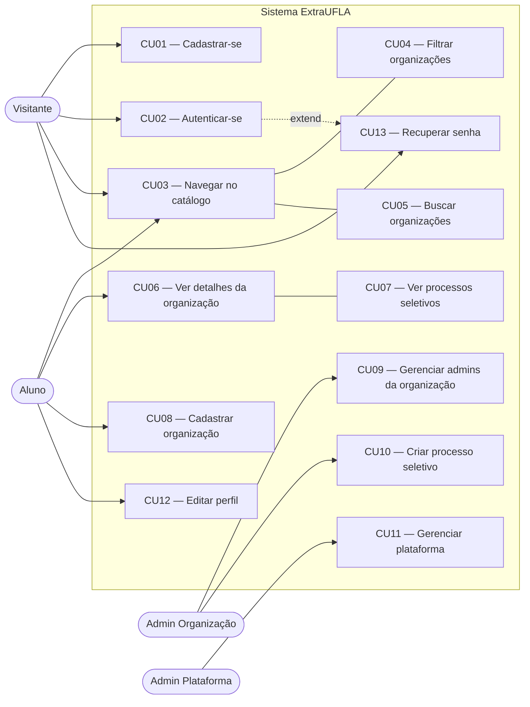
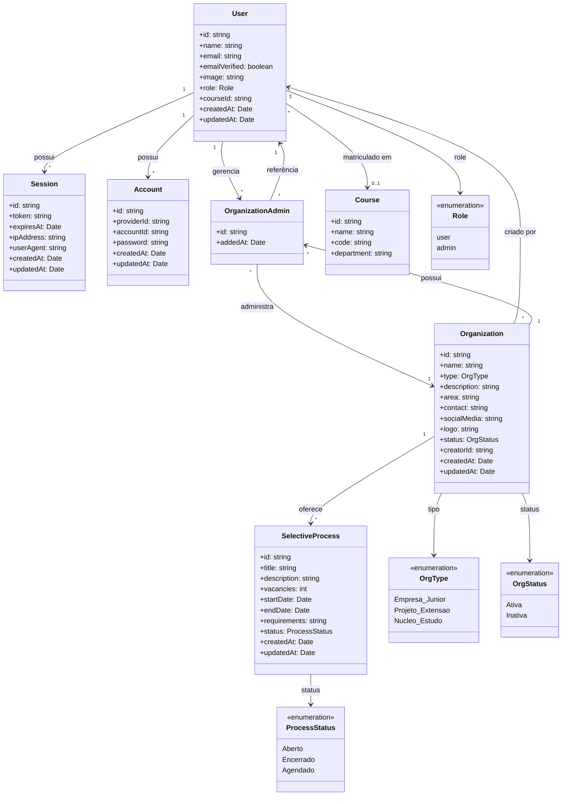
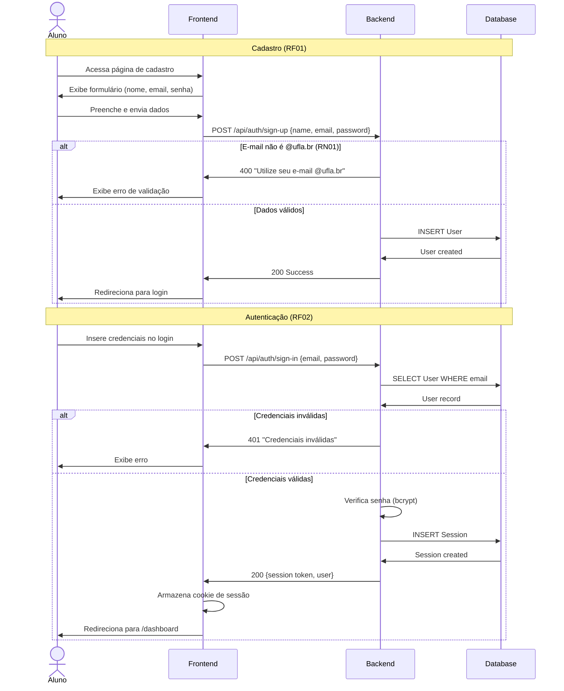
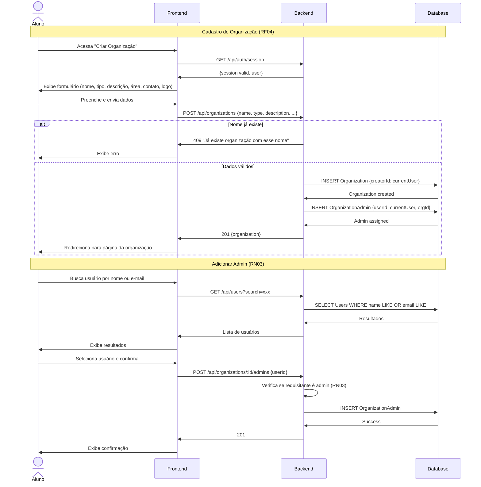

# 05. Modelagem

## 1. Objetivo da modelagem

A modelagem do ExtraUFLA busca representar a estrutura estática, o comportamento dinâmico e as interações dos usuários com o sistema. Os diagramas foram produzidos a partir dos requisitos definidos na Sprint 2 (`04_requisitos.md`) e cobrem tanto funcionalidades já implementadas (RF01, RF02) quanto funcionalidades planejadas (RF04, RF05, RF11, etc.).

Todos os diagramas utilizam **MermaidJS**, permitindo versionamento no repositório e renderização direta no GitHub.

---

## 2. Modelo de domínio

O sistema ExtraUFLA é composto por oito entidades principais organizadas em torno de **usuários**, **organizações** e **processos seletivos**.

### Entidades principais

- **User** — Usuário do sistema (aluno ou admin). Possui e-mail institucional @ufla.br (RN01) e role que define seu nível de acesso.
- **Organization** — Organização extracurricular (empresa júnior, projeto de extensão ou núcleo de estudo). Classificação obrigatória por tipo (RN04).
- **OrganizationAdmin** — Entidade associativa entre User e Organization. Suporta múltiplos administradores por organização (RN03).
- **SelectiveProcess** — Processo seletivo com status automático derivado das datas de início e fim (RN02).
- **Course** — Curso de graduação para personalização do conteúdo (RF03).
- **Session** — Sessão ativa do usuário, controlada pelo better-auth.
- **Account** — Credenciais de autenticação (senha hasheada com bcrypt).
- **Verification** — Tokens de verificação de e-mail e recuperação de senha.

### Enums

- **Role** — `user` | `admin` (define se o usuário é admin da plataforma — RF05)
- **OrgType** — `Empresa_Junior` | `Projeto_Extensao` | `Nucleo_Estudo` (RN04)
- **OrgStatus** — `Ativa` | `Inativa`
- **ProcessStatus** — `Aberto` | `Encerrado` | `Agendado` (RN02)

---

## 3. Diagramas propostos

### 3.1 Diagrama de casos de uso

**Objetivo:** Representar os atores do sistema e as funcionalidades disponíveis para cada perfil de acesso.

**Atores principais:**
- **Visitante** — navega no catálogo sem autenticação (RF16)
- **Aluno** — autenticado, pode criar organizações e editar perfil
- **Admin Organização** — gerencia dados da organização e processos seletivos
- **Admin Plataforma** — gerencia toda a plataforma (RF05)

**Casos de uso principais:**
- 13 casos de uso cobrindo RF01–RF16
- Relações `<<include>>` entre CU03↔CU04, CU03↔CU05, CU06↔CU07
- Relação `<<extend>>` entre CU02↔CU13 (recuperação de senha estende autenticação)

### 3.2 Diagrama de classes

**Objetivo:** Representar a estrutura estática do sistema com entidades, atributos, métodos e relacionamentos.

**Principais classes:**
- User, Session, Account, Verification (camada de autenticação — já implementada)
- Organization, OrganizationAdmin, SelectiveProcess (camada de domínio — planejada)
- Course (entidade auxiliar — planejada)

### 3.3 Diagramas de sequência

**Objetivo:** Representar a interação entre os componentes do sistema nos fluxos principais.

**Processos representados:**
1. **Cadastro e autenticação** — fluxo de registro com validação @ufla.br e login com sessão (RF01, RF02, RN01)
2. **Criação de organização e gerenciamento de admins** — fluxo de cadastro de org e adição de novos administradores (RF04, RN03)

#### Sequência 1: Cadastro e Autenticação

#### Sequência 2: Criação de Organização e Gerenciamento de Admins

---

## 4. Decisões de modelagem

| Decisão | Justificativa |
|---------|--------------|
| MermaidJS para todos os diagramas | Versionável no repositório, renderiza no GitHub, sem ferramentas externas |
| OrganizationAdmin como entidade associativa | Suporta RN03: múltiplos administradores por organização com relacionamento N:M |
| Role (enum) no User | Mapeia para o plugin admin do better-auth (RF05), diferenciando usuário comum de admin da plataforma |
| ProcessStatus como enum automático | Suporta RN02: status derivado das datas de início/fim, não definido manualmente |
| Course como entidade separada | Normaliza dados e suporta RF03 (seleção de curso), mesmo adiada para Sprint 4 |
| Diagramas de sequência para cadastro + criação de org | Fluxos mais críticos e ariteturalmente significativos, exercitam RF01, RF02, RF04 e RN01, RN03 |
| flowchart LR para casos de uso | MermaidJS não possui tipo nativo de diagrama de casos de uso UML; flowchart com subgraph aproxima a notação |

---

## 5. Exemplo de descrição textual

> O sistema ExtraUFLA possui as entidades **User**, **Organization**, **SelectiveProcess** e **Course**. Um **User** pode criar várias **Organizations** (tornando-se automaticamente **OrganizationAdmin** de cada uma). Cada **Organization** oferece múltiplos **SelectiveProcesses** com status automático baseado nas datas (Aberto, Encerrado ou Agendado). **Users** podem pertencer a um **Course** e possuem um **Role** que define seu nível de acesso (usuário comum ou admin da plataforma). Dados do catálogo são públicos; dados de perfil são privados e visíveis apenas ao próprio aluno ou admins da plataforma (RN05).

---

## 6. Rastreabilidade requisitos-modelos

### 6.1 Requisitos Funcionais

| Requisito | Caso(s) de Uso | Diagrama(s) | Classe(s) |
|-----------|---------------|-------------|-----------|
| RF01 | CU01 | Seq 3.3.1 | User, Account |
| RF02 | CU02 | Seq 3.3.1 | User, Session |
| RF03 | CU12 (parcial) | Classes | User, Course |
| RF04 | CU08 | Seq 3.3.2 | Organization, OrganizationAdmin |
| RF05 | CU11 | Classes | User (role=admin) |
| RF06 | CU03 | Casos de Uso | Organization |
| RF07 | CU06 | Casos de Uso | Organization |
| RF08 | CU07 | Casos de Uso | SelectiveProcess |
| RF09 | CU04 | Casos de Uso | Organization (OrgType) |
| RF10 | CU05 | Casos de Uso | Organization |
| RF11 | CU10 | Seq 3.3.2 | SelectiveProcess |
| RF12 | — | — | SelectiveProcess |
| RF13 | CU12 | Casos de Uso | User |
| RF14 | — | Classes | User, SelectiveProcess |
| RF15 | CU13 | Seq 3.3.1 | User, Verification |
| RF16 | CU03, CU06 | Casos de Uso | Organization |

### 6.2 Requisitos Não Funcionais

| Requisito | Categoria | Aplicável a |
|-----------|-----------|-------------|
| RNF01 | Usabilidade | Todos os diagramas (responsividade) |
| RNF02 | Desempenho | Seq 3.3.1, 3.3.2 (LCP < 3s) |
| RNF03 | Segurança | Seq 3.3.1 (bcrypt, JWT, HTTPS) |
| RNF04 | Acessibilidade | Casos de Uso (interação com atores) |
| RNF05 | Compatibilidade | Transversal (todos os fluxos) |
| RNF06 | Confiabilidade | Infraestrutura (CI/CD, deploy) |
| RNF07 | Usabilidade | Seq 3.3.1, 3.3.2 (feedback visual) |

### 6.3 Regras de Negócio

| Regra | Diagrama(s) | Classe(s) | Descrição |
|-------|-------------|-----------|-----------|
| RN01 | Seq 3.3.1 | User | Validação @ufla.br no cadastro |
| RN02 | Classes | SelectiveProcess (ProcessStatus) | Status automático por datas |
| RN03 | Seq 3.3.2, Classes | OrganizationAdmin | Múltiplos admins por organização |
| RN04 | Classes | Organization (OrgType) | Classificação obrigatória por tipo |
| RN05 | Casos de Uso, Classes | User (role), OrganizationAdmin | Visibilidade por papel de acesso |
