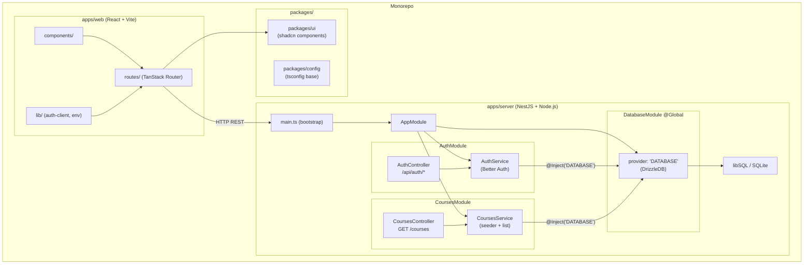
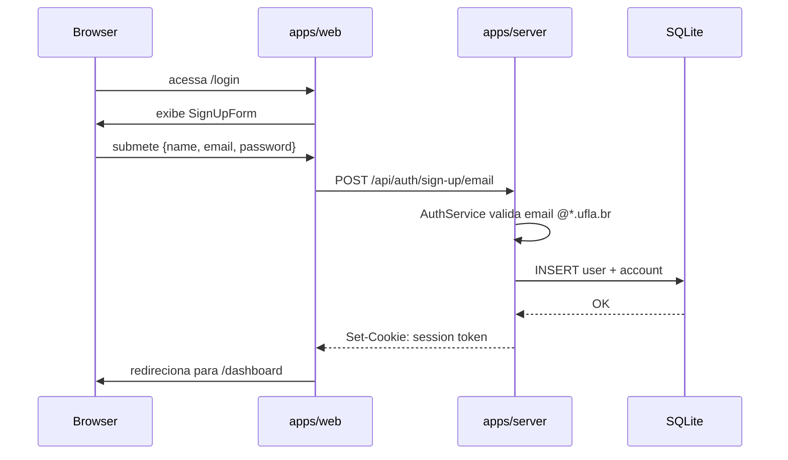

# Arquitetura de Software — ExtraUFLA

## 1. Visão geral

O ExtraUFLA é estruturado como um **monorepo** com dois aplicativos e dois
pacotes compartilhados, orquestrado pelo Turbo. A comunicação entre frontend e
backend ocorre exclusivamente via **HTTP REST**.

```
extraufla/                         ← raiz do monorepo (Turbo + Bun workspaces)
├── apps/
│   ├── web/                       ← frontend SPA (React + Vite)
│   └── server/                    ← backend API (NestJS + Node.js)
└── packages/
    ├── ui/                        ← componentes compartilhados (shadcn/ui)
    └── config/                    ← configuração base de TypeScript
```

A decisão de usar um monorepo facilita a rastreabilidade entre camadas e elimina
divergências de versão entre apps e pacotes. O Turbo garante execução paralela
de tarefas (`dev`, `build`, `check-types`) com cache incremental.

---

## 2. Arquitetura em camadas

A solução é organizada em quatro camadas verticais, presentes tanto no frontend
quanto no backend:

```
┌──────────────────────────────────────────────────────────┐
│  APRESENTAÇÃO  │  React + TanStack Router (apps/web)      │
├──────────────────────────────────────────────────────────┤
│  APLICAÇÃO     │  NestJS Controllers / Routes             │
├──────────────────────────────────────────────────────────┤
│  DOMÍNIO       │  NestJS Services + Better Auth           │
├──────────────────────────────────────────────────────────┤
│  PERSISTÊNCIA  │  Drizzle ORM + libSQL (SQLite/Turso)     │
└──────────────────────────────────────────────────────────┘
```

| Camada | Responsabilidade | Tecnologia |
|---|---|---|
| Apresentação | Renderização de UI, rotas do cliente, formulários, feedback visual | React 19, TanStack Router, Tailwind CSS |
| Aplicação | Recebimento de requisições HTTP, validação de entrada, orquestração | NestJS Controllers (`@Controller`, `@Get`, `@All`) |
| Domínio | Regras de negócio, sessão, autenticação, seeding | NestJS Services (`@Injectable`, `OnModuleInit`) |
| Persistência | Schema relacional, migrações, acesso a dados tipado | Drizzle ORM + `@libsql/client` |

### Separação frontend / backend

O frontend (`apps/web`) não acessa o banco diretamente. Toda interação ocorre
via chamadas HTTP à API em `apps/server`. O único contrato entre as camadas é a
interface HTTP: URLs, métodos e formato JSON das respostas.

```
apps/web  ──────────── HTTP REST ───────────▶  apps/server
  (Vite/React, porta 5173)                      (NestJS/Node.js, porta 3000)
```

---

## 3. Backend — apps/server

### 3.1 Estrutura de módulos NestJS

O servidor adota a arquitetura nativa do NestJS: cada área funcional é
encapsulada em um **módulo** que agrupa providers, controllers e dependências.

```
apps/server/src/
├── main.ts                            # bootstrap: cria app, habilita CORS, listen()
├── app.module.ts                      # AppModule: importa os três módulos de domínio
├── common/
│   └── env.ts                         # validação de variáveis de ambiente (Zod)
├── database/
│   ├── database.module.ts             # DatabaseModule (@Global): provider 'DATABASE'
│   └── schema/
│       ├── auth.ts                    # tabelas user, session, account, verification
│       ├── course.ts                  # tabela course + relação com user
│       └── index.ts                   # re-exporta todo o schema
├── auth/
│   ├── auth.module.ts                 # AuthModule: AuthService + AuthController
│   ├── auth.service.ts                # Better Auth: instancia e configura a lib
│   └── auth.controller.ts             # @All('*') em /api/auth — delega ao handler
└── courses/
    ├── courses.module.ts              # CoursesModule: CoursesService + CoursesController
    ├── courses.service.ts             # seeding idempotente + listCourses()
    └── courses.controller.ts          # GET /courses
```

### 3.2 Hierarquia de módulos e injeção de dependências

```
AppModule
 ├── DatabaseModule  (@Global)
 │    └── provider: 'DATABASE'  →  DrizzleDB (useFactory)
 ├── AuthModule
 │    ├── AuthService  ← injeta 'DATABASE'
 │    └── AuthController
 └── CoursesModule
      ├── CoursesService  ← injeta 'DATABASE'
      └── CoursesController
```

O `DatabaseModule` é declarado com `@Global()`, de modo que o token `'DATABASE'`
é injetável em qualquer módulo sem precisar importar `DatabaseModule`
explicitamente. Isso evita acoplamento de importação nos módulos consumidores.

### 3.3 DatabaseModule — padrão Factory + Facade

```typescript
// database/database.module.ts (simplificado)
const databaseProvider = {
  provide: 'DATABASE',
  useFactory: (): DrizzleDB => {
    const client = createClient({ url: env.DATABASE_URL });
    return drizzle({ client, schema });
  },
};

@Global()
@Module({ providers: [databaseProvider], exports: ['DATABASE'] })
export class DatabaseModule {}
```

O `useFactory` encapsula a construção da instância Drizzle (Factory Method). O
módulo expõe apenas o token `'DATABASE'` para o restante da aplicação, ocultando
`@libsql/client` e os detalhes de configuração (Facade).

### 3.4 AuthModule — autenticação com Better Auth

O `AuthService` recebe a instância Drizzle via injeção de dependências (`@Inject('DATABASE')`)
e inicializa o Better Auth com o adapter Drizzle. O `AuthController` monta um
handler curinga em `/api/auth/*` que delega todas as requisições ao handler
nativo da lib, incluindo sign-up, sign-in, sign-out e gerenciamento de sessão.

Regras de negócio implementadas no `AuthService`:

- Restrição de cadastro a e-mails `@*.ufla.br` (via `databaseHooks`).
- Configuração de cookies `httpOnly` + `sameSite: none` + `secure: true`.

### 3.5 CoursesModule — seeding e listagem

O `CoursesService` implementa `OnModuleInit`: ao inicializar, executa o seeding
idempotente dos cursos de graduação a partir de `data/courses.json` (inserção
com `onConflictDoNothing`). O `CoursesController` expõe `GET /courses`.

### 3.6 Validação de ambiente

O arquivo `common/env.ts` usa `@t3-oss/env-core` com Zod para validar e tipar
as variáveis de ambiente no bootstrap. Qualquer variável ausente ou inválida
causa falha imediata (`fail-fast`), com mensagem descritiva.

```
DATABASE_URL      STRING (min 1)
BETTER_AUTH_SECRET STRING (min 32)
BETTER_AUTH_URL   URL
CORS_ORIGIN       URL
NODE_ENV          enum(development|production|test)  default: development
PORT              number  default: 3000
```

### 3.7 Schema de banco de dados

O schema relacional é declarado com Drizzle ORM em `database/schema/`:

```
user          id(PK), name, email(unique), emailVerified, image, courseId(FK→course)
session       id(PK), expiresAt, token(unique), userId(FK→user), ipAddress, userAgent
account       id(PK), accountId, providerId, userId(FK→user), accessToken, ...
verification  id(PK), identifier, value, expiresAt
course        id(PK), name(unique), createdAt, updatedAt
```

A relação `user → course` (N:1) suporta a personalização de conteúdo por curso
(RF03, RF04), central na proposta do ExtraUFLA.

---

## 4. Frontend — apps/web

### 4.1 Estrutura de arquivos

```
apps/web/src/
├── main.tsx                           # entrada: TanStack Router + ThemeProvider
├── index.css                          # Tailwind CSS base
├── routes/
│   ├── __root.tsx                     # layout raiz (Header, Toaster, Devtools)
│   ├── index.tsx                      # página inicial / landing
│   ├── login.tsx                      # página de login/cadastro
│   └── dashboard.tsx                  # área autenticada
├── components/
│   ├── header.tsx                     # navbar com ThemeToggle e UserMenu
│   ├── sign-in-form.tsx               # formulário de login (TanStack Form + Zod)
│   ├── sign-up-form.tsx               # formulário de cadastro
│   ├── user-menu.tsx                  # dropdown com info do usuário e sign-out
│   ├── mode-toggle.tsx                # botão dark/light mode
│   ├── theme-provider.tsx             # next-themes provider
│   └── loader.tsx                     # spinner de carregamento
└── lib/
    ├── auth-client.ts                 # Better Auth client (aponta para VITE_SERVER_URL)
    └── env.ts                         # validação de VITE_SERVER_URL (Zod)
```

### 4.2 Roteamento e guardas

O TanStack Router usa **roteamento baseado em arquivos** (`routes/`). Rotas
protegidas redirecionam para `/login` quando não há sessão ativa. A sessão é
gerenciada pelo `auth-client` do Better Auth, que mantém o estado no cliente
via cookies.

### 4.3 Formulários e validação

Formulários usam `@tanstack/react-form` + resolvers Zod para validação de
campos (e-mail institucional `@*.ufla.br`, senha, nome). Erros são exibidos
inline; toasts do `sonner` notificam sucesso/falha das operações.

---

## 5. Pacotes compartilhados

| Pacote | Conteúdo | Consumidores |
|---|---|---|
| `packages/ui` | Componentes reutilizáveis baseados em shadcn/ui (Button, Input, Card, Form, etc.) | `apps/web` |
| `packages/config` | Configuração base de TypeScript (`tsconfig.base.json`) | `apps/web`, `apps/server` |

---

## 6. Diagrama de componentes



---

## 7. Fluxo de autenticação



---

## 8. Relação com requisitos não funcionais

| RNF | Descrição | Como a arquitetura atende |
|---|---|---|
| RNF01 | Desempenho: ≤ 2s por requisição | SQLite local, sem round-trip de rede no banco; Drizzle sem N+1 |
| RNF02 | Segurança: senhas protegidas, sessão segura | Better Auth: hash bcrypt, cookies httpOnly + secure + sameSite:none |
| RNF03 | Acessibilidade: conformidade básica WCAG | shadcn/ui com roles ARIA nativos; Tailwind sem sobrescrever semântica HTML |
| RNF04 | Manutenibilidade: código legível e modular | NestJS Module/Controller/Service; Biome para lint/format; TypeScript estrito |
| RNF05 | Escalabilidade: base para evolução sem refactor total | Package-by-feature; DI desacopla consumidores de implementações |
| RNF06 | Compatibilidade: navegadores modernos | Vite com targets ES2020+; sem polyfills legados |
| RNF07 | Rastreabilidade: requisitos ligados ao código | Módulos NestJS mapeados a RFs; schema de BD derivado dos requisitos de domínio |

---

## 9. Decisões arquiteturais relevantes

| Decisão | Alternativas consideradas | Justificativa |
|---|---|---|
| NestJS como framework backend | Express (sem DI), Fastify+NestJS, Hono | Módulos, DI nativa e decoradores tornam a arquitetura explícita, testável e documentável |
| Monorepo (Bun workspaces + Turbo) | Repositórios separados, nx | Rastreabilidade entre camadas, build incremental com cache, versões alinhadas |
| SQLite/libSQL com Drizzle | PostgreSQL, MongoDB | Setup simples, zero custo operacional na fase acadêmica; migração para Turso em produção sem mudar ORM |
| Better Auth com adapter Drizzle | Auth.js, Clerk, implementação manual | Integração direta com o schema Drizzle, sem duplicar tabelas; regras de domínio (e-mail UFLA) via hooks |
| TanStack Router (tipado) | React Router, Next.js | Rotas com tipos inferidos, guardas de autenticação na definição de rota, sem overhead de SSR |
| `@Global()` em DatabaseModule | Importar DatabaseModule em cada módulo | Evita acoplamento de importação; o banco é um serviço transversal |

---

## 10. Evolução arquitetural planejada

À medida que os RFs de catálogo (RF05-RF09) e processos seletivos (RF11-RF12)
forem implementados, espera-se:

- Introdução do padrão **Repository** em módulos com consultas compostas (filtros,
  busca, paginação).
- Criação dos módulos `OrganizationModule` e `SelectionProcessModule` seguindo a
  mesma estrutura package-by-feature.
- Extensão do `CoursesModule` para suportar vínculo entre cursos e organizações
  (RF04-RF06).
- Possível extração do serviço de autenticação para um módulo separado de
  políticas, se as regras de domínio de acesso crescerem.
