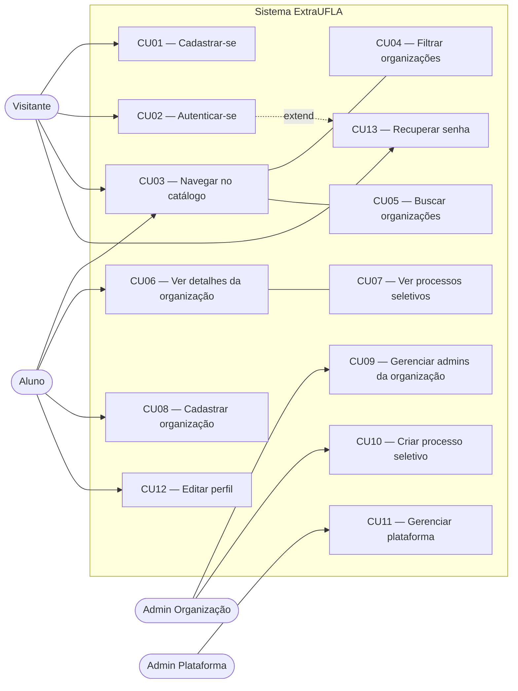
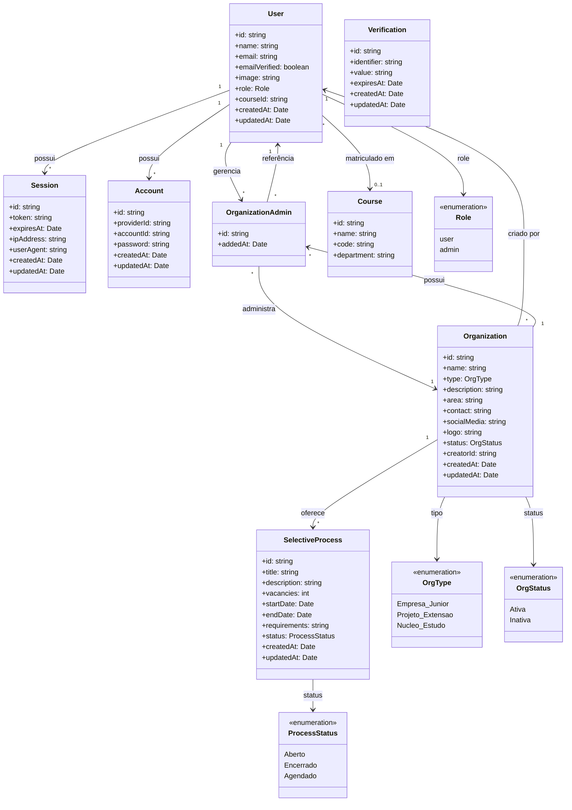
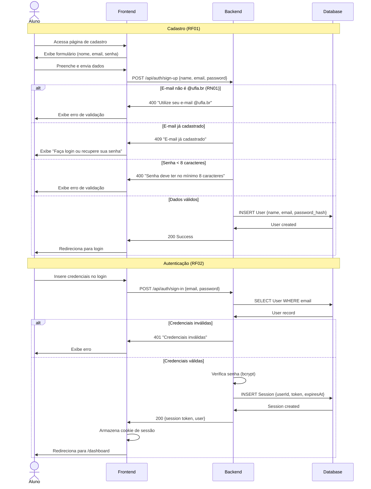
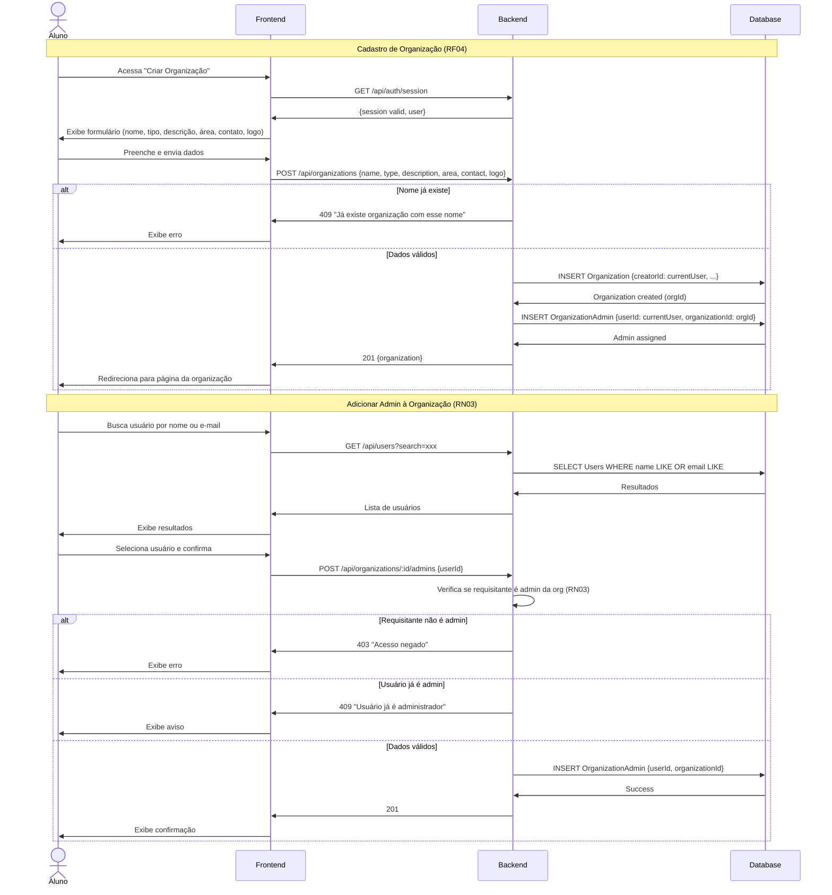

# Modelagem — ExtraUFLA

> Produzido na Sprint 3 (25/04–02/05/2026). Diagramas em MermaidJS, versionados no repositório.

---

## 1. Visão geral

Esta documentação apresenta a modelagem do sistema ExtraUFLA, cobrindo:

- **Estrutura estática** — diagrama de classes/domínio com entidades, atributos e relacionamentos
- **Interação com o usuário** — diagrama de casos de uso com atores e funcionalidades
- **Comportamento dinâmico** — diagramas de sequência para os fluxos principais
- **Rastreabilidade** — vínculo entre requisitos (RF, RNF, RN) e os modelos produzidos

A modelagem foi derivada dos requisitos definidos na Sprint 2 (`04_requisitos.md`) e inclui funcionalidades ainda não implementadas (RF04, RF05, RF11) para garantir cobertura completa do escopo planejado.

---

## 2. Atores do sistema

| Ator | Descrição | Autenticação |
|------|-----------|-------------|
| **Visitante** | Qualquer pessoa que acessa a plataforma sem login | Nenhuma |
| **Aluno** | Estudante autenticado com e-mail @ufla.br | Obrigatória (RF01, RF02) |
| **Admin Organização** | Aluno que criou ou foi adicionado como administrador de uma organização | Obrigatória + papel de admin da org (RN03) |
| **Admin Plataforma** | Usuário com role `admin` no better-auth para gerenciar toda a plataforma | Obrigatória + role admin (RF05) |

Herança entre atores: Admin Plataforma ⊃ Admin Organização ⊃ Aluno ⊃ Visitante (cada nível herda as permissões do anterior).

---

## 3. Diagrama de Casos de Uso

### Mapeamento casos de uso → requisitos

| Caso de uso | Requisito(s) | Descrição |
|-------------|-------------|-----------|
| CU01 | RF01 | Cadastro de aluno com e-mail @ufla.br |
| CU02 | RF02 | Login/logout com sessão persistida |
| CU03 | RF06, RF16 | Navegação pública no catálogo de organizações |
| CU04 | RF09 | Filtro por tipo (EJ, Extensão, Núcleo) |
| CU05 | RF10 | Busca textual por nome ou palavra-chave |
| CU06 | RF07 | Página de detalhes da organização |
| CU07 | RF08 | Visualização de processos seletivos abertos |
| CU08 | RF04 | Criação de organização (criador vira admin — RN03) |
| CU09 | RN03 | Adicionar/remover administradores da organização |
| CU10 | RF11 | Criação de processo seletivo pelo admin da org |
| CU11 | RF05 | Gerenciamento completo da plataforma (CRUD usuários, orgs, sessões) |
| CU12 | RF13 | Edição de perfil (nome, curso, avatar) |
| CU13 | RF15 | Recuperação de senha via link por e-mail |

### Observações

- **RF03** (seleção de curso) e **RF14** (dashboard) não aparecem como casos de uso separados: RF03 é parte do fluxo de CU12 (editar perfil) e RF14 é o redirecionamento pós-CU02.
- **RF12** (notificação de prazos) é um requisito transversal (background job) e não tem interação direta com ator — aparece na rastreabilidade como requisito não funcional relacionado.
- CU04 e CU05 são funcionalidades incluídas em CU03 (filtra e busca dentro do catálogo).
- CU07 é acessível a partir de CU06 (detalhes da organização mostram processos seletivos).

---

## 4. Diagrama de Classes / Domínio

### Descrição das entidades

| Entidade | Descrição | Requisitos relacionados |
|----------|-----------|------------------------|
| **User** | Usuário do sistema (aluno ou admin). E-mail institucional @ufla.br obrigatório (RN01) | RF01, RF02, RF04, RF05, RF13 |
| **Session** | Sessão ativa do usuário. Controlada pelo better-auth | RF02 |
| **Account** | Credenciais de autenticação (senha hasheada) | RF01, RF02, RNF03 |
| **Verification** | Tokens de verificação de e-mail e recuperação de senha | RF01, RF15 |
| **Organization** | Organização extracurricular (EJ, extensão ou núcleo). Classificação obrigatória por tipo (RN04) | RF04, RF06, RF07, RF09 |
| **OrganizationAdmin** | Entidade associativa entre User e Organization. Suporta múltiplos admins por org (RN03) | RF04, RN03 |
| **SelectiveProcess** | Processo seletivo com status automático derivado das datas (RN02) | RF08, RF11 |
| **Course** | Curso de graduação para personalização (RF03 — adiado) | RF03 |

---

## 5. Diagramas de Sequência

### 5.1 Cadastro e Autenticação (RF01 + RF02 + RN01)

### 5.2 Criação de Organização e Gerenciamento de Admins (RF04 + RN03)

---

## 6. Vínculo entre requisitos e modelos

### 6.1 Requisitos Funcionais → Modelos

| Requisito | Caso(s) de Uso | Diagrama(s) | Classe(s) |
|-----------|---------------|-------------|-----------|
| RF01 | CU01 | Seq 5.1 | User, Account |
| RF02 | CU02 | Seq 5.1 | User, Session |
| RF03 | CU12 (parcial) | Classes | User, Course |
| RF04 | CU08 | Seq 5.2 | Organization, OrganizationAdmin |
| RF05 | CU11 | Classes | User (role=admin) |
| RF06 | CU03 | Casos de Uso | Organization |
| RF07 | CU06 | Casos de Uso | Organization |
| RF08 | CU07 | Casos de Uso | SelectiveProcess |
| RF09 | CU04 | Casos de Uso | Organization (OrgType) |
| RF10 | CU05 | Casos de Uso | Organization |
| RF11 | CU10 | Seq 5.2 | SelectiveProcess |
| RF12 | — | — | SelectiveProcess |
| RF13 | CU12 | Casos de Uso | User |
| RF14 | — | Classes | User, SelectiveProcess |
| RF15 | CU13 | Seq 5.1 | User, Verification |
| RF16 | CU03, CU06 | Casos de Uso | Organization |

### 6.2 Requisitos Não Funcionais → Aplicabilidade

| Requisito | Categoria | Aplicável a |
|-----------|-----------|-------------|
| RNF01 | Usabilidade | Todos os diagramas (responsividade afeta toda a UI) |
| RNF02 | Desempenho | Seq 5.1, 5.2 (LCP < 3s nos fluxos críticos) |
| RNF03 | Segurança | Seq 5.1 (bcrypt, JWT, HTTPS no fluxo de autenticação) |
| RNF04 | Acessibilidade | Casos de Uso (interação com todos os atores) |
| RNF05 | Compatibilidade | Transversal (todos os fluxos em browsers suportados) |
| RNF06 | Confiabilidade | Infraestrutura (deploy, CI/CD) |
| RNF07 | Usabilidade | Seq 5.1, 5.2 (feedback visual em loading, sucesso, erro) |

### 6.3 Regras de Negócio → Diagramas

| Regra | Diagrama(s) | Classe(s) | Descrição |
|-------|-------------|-----------|-----------|
| RN01 | Seq 5.1 | User | Validação @ufla.br no cadastro |
| RN02 | Classes | SelectiveProcess (ProcessStatus) | Status automático derivado das datas |
| RN03 | Seq 5.2, Classes | OrganizationAdmin | Múltiplos admins por organização |
| RN04 | Classes | Organization (OrgType) | Classificação obrigatória em um de três tipos |
| RN05 | Casos de Uso, Classes | User (role), OrganizationAdmin | Visibilidade de dados por papel |
